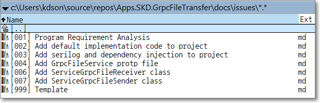

## 1. OVERVIEW

### 1.1 DESCRIPTION

- This issue works to improve the following features
- This issue fixes the following bugs

### 1.2 SUMMARY

- Kind: Epic, Story, **Task**, Bug
- Priority:  Lowest, Low, **Medium**, High, Highest
- Status: **not allocated**, not started, started, testing, completed
- Prev. Work: N/A
- Next Work:  N/A

* Registrant: Song, Kyung-dong (kdsong69@gmail.com)
* Registration Date:  2025-04-01 21:00

- Operator: Song, Kyung-dong (kdsong69@gmail.com)
- Estimated Working Time: ? H
- Actual Working Time: ? H
- Start of Work:  
- Completion of Work: 

* Inspector: Song, Kyung-dong (kdsong69@gmail.com)
* Inspection Date and Time:  
* Inspection Result:   
  

<!--------------------------------------------------------------------------------------------------->
## 2. WORK NOTE

### 2.1. SYMPTOM, REQUIREMENT
 

### 2.2. CAUSE

 

### 2.3. RESOLUTION
 

### 2.9. REMAIN PROBLEM
 

<!--------------------------------------------------------------------------------------------------->
## 3. REMAIN PROBLEM
- nothing